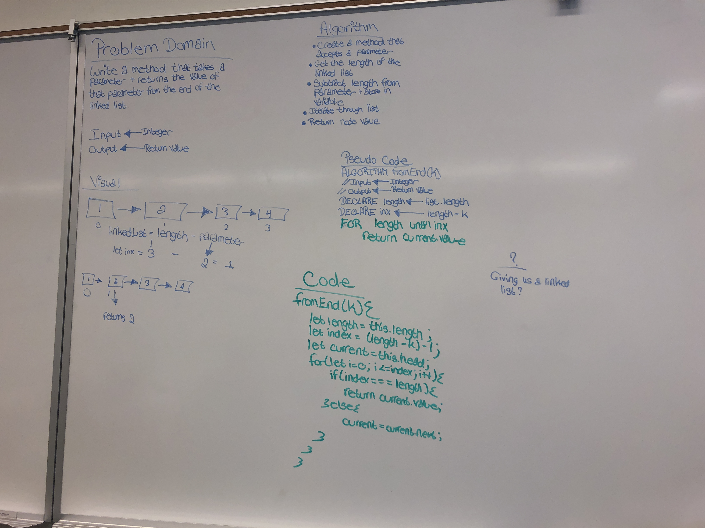
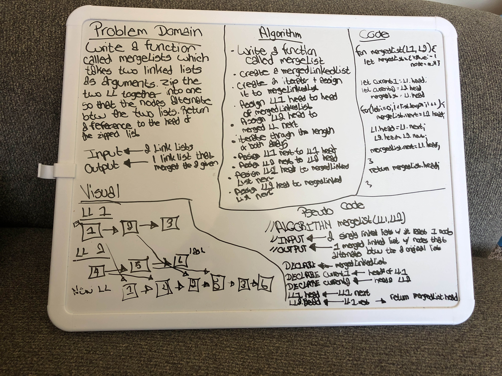

# Singly Linked List

Implementing Singly Linked List utilizing classes

## Challenge

Implement insert, includes, print, append, insertAfter, and insertBefore methods

## Approach & Efficiency

I reviewed the class demo, did a lot of research to learn more about Linked Lists, and then planned my project

## Methods: 

insert

includes

printList

append(value)

insertBefore(value, index)

insertAfter(value, index)

kthFromEnd(k)

#### Linked List Insertions image

------
------

## Code Challenge

#### Feature Tasks

Write the following methods for the Linked List class:

.append(value) which adds a new node with the given value to the end of the list

.insertBefore(value, newVal) which add a new node with the given newValue immediately before the first value node

.insertAfter(value, newVal) which add a new node with the given newValue immediately after the first value node

