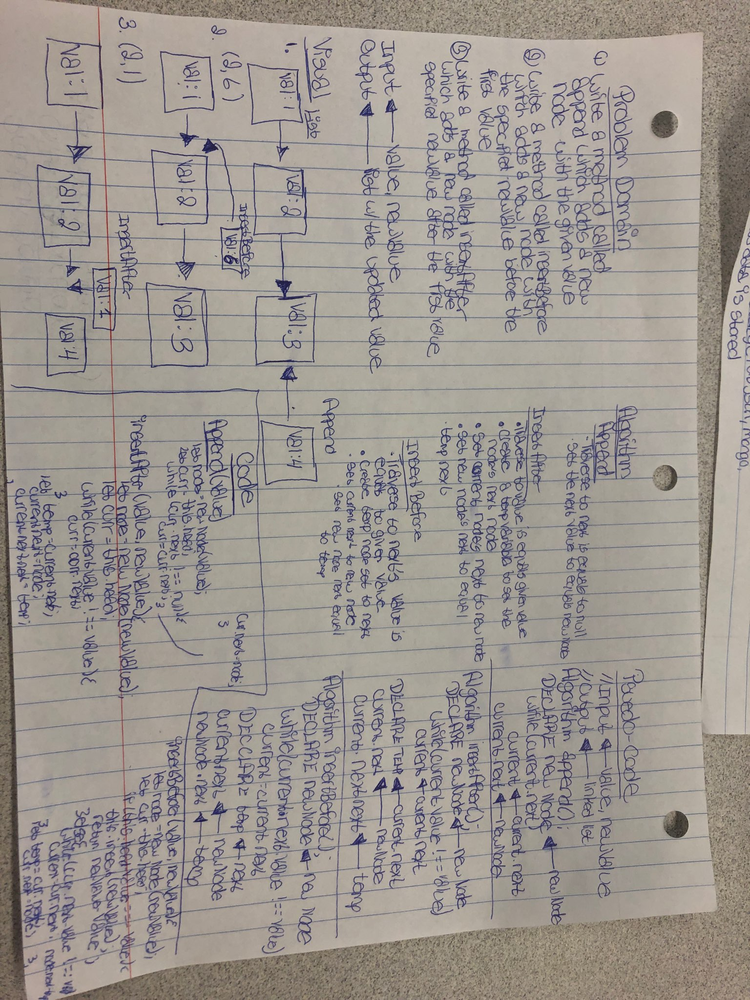

# Singly Linked List
Create a Node Class
Create a LinkList Class
Define a method called insert
Define a method called includes
Define a method called print

## Challenge
Implement a Singly Linked List Data Structure

## Approach & Efficiency
O(n)

## API
Insert which takes any value as an argument and adds a new node with that value to the head of the list with an O(1) Time performance.

Includes which takes any value as an argument and returns a boolean result depending on whether that value exists as a Node’s value somewhere within the list

Print which takes in no arguments and returns a collection all of the current Node values in the Linked List.

##Code Challenge: Class 06
  

##Code Challenge: Class 07
  
  [Pull Request](https://github.com/TRose2014/data-structures-and-algorithms/compare/ll_kth_from_end?expand=1)