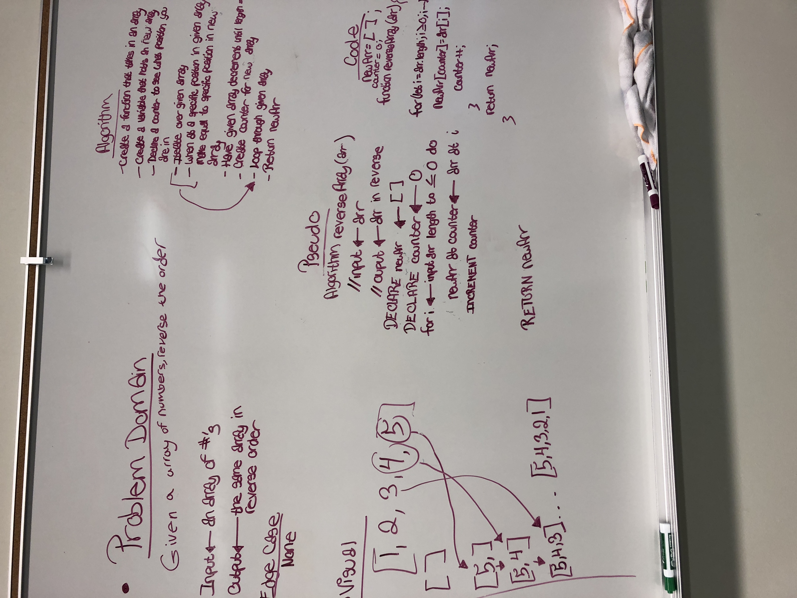

#Reverse an array

## Challenge
Given an array of numbers, reverse the order of the array with the last number of the given array, being the first number in the new array

##Approach & Efficiency
I wanted to grab the element of the last index and stick it in the first element of the new array. Then I wanted to take the second to last index of the given array and stick that to into the second index of the new array and so on and so for. I had to iterate through the given array backwards, and keep a counter to see where I was in the new Array.

##Solution

