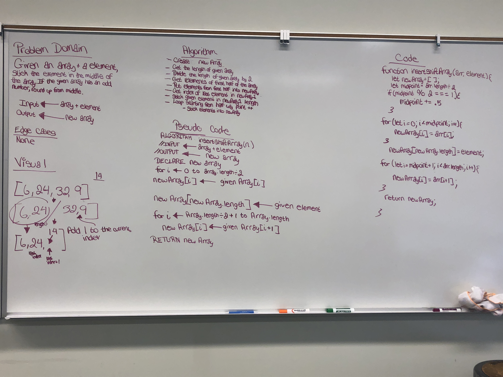

# Challenge Summary
Array Shift

## Challenge Description
Given an array and an element, insert that element in the middle of the array.

## Approach & Efficiency
With the given array, I wanted to divide the array in half. The first half of the array would be push into a new array. Then I wanted to grab the index number of the last array that is inside my new array and add the element in my new array which would be the last index number + 1; Then I created an if statement to test if the array has an odd number of elements and round it up. Then I put the concatonate of the given array with my new array.

## Solution
